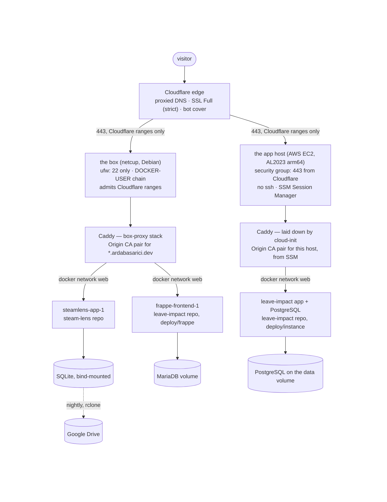
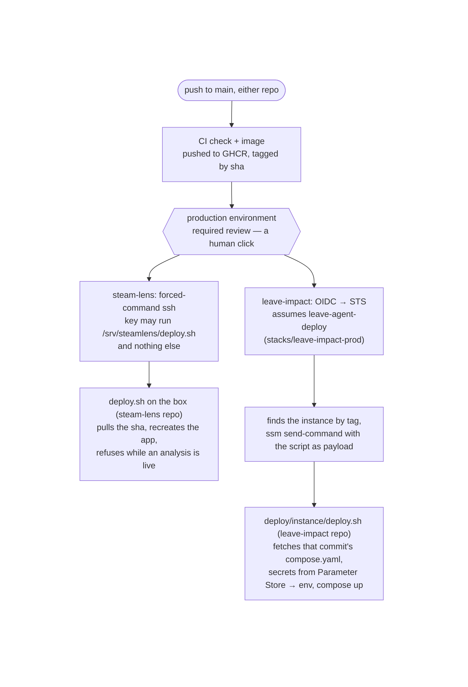
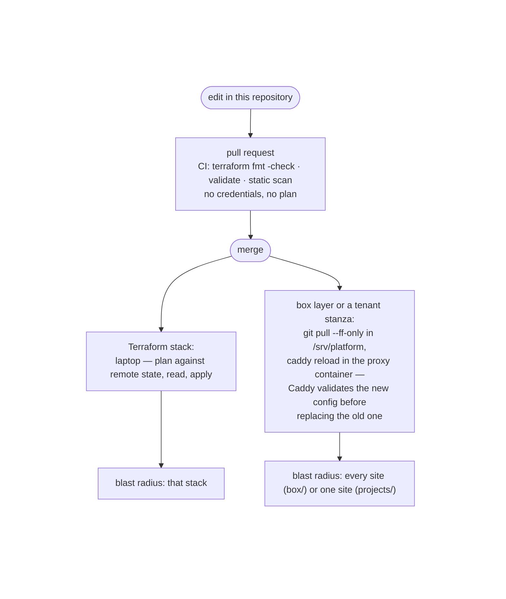

# ARCHITECTURE — platform

How the operational layer is built: the hosts, the paths a request / a deploy / a
backup / an infrastructure change take through it, the repository map, the state
map, and the seam between platform and application. The *why* behind each shape is
DESIGN.md's; this document describes the system as it stands.

*Snapshot of a system being extracted · last updated 2026-08-26 · describes the
running system and the target repository layout; the repository map's last column
says which files have moved.*

---

## The physical picture

Two hosts of the same shape, one per provider, each serving its own tenants behind
its own proxy. Nothing runs on both.

The rules that make them the same machine twice:

| Rule | On the box | On the app host |
|---|---|---|
| The origin answers only Cloudflare, only on 443 | DOCKER-USER chain from `firewall.sh`, applied each boot | security group ingress from Cloudflare's ranges |
| TLS at the origin is a Cloudflare Origin CA pair, never ACME | one pair for `*.ardabasarici.dev`, scp'd | one pair per host, read from SSM at boot |
| Caddy trusts `CF-Connecting-IP` only from a Cloudflare peer | global block `trusted_proxies` | same block |
| Applications join `web` as an external network and publish no port | `docker network create web` in the runbook | created by cloud-init |
| The proxy reaches an application by its Compose container name | `steamlens-app-1:8000`, `frappe-frontend-1:8080` | the app's service name |
| Administrative access | key-only ssh, root login off | no ssh; SSM Session Manager |

What differs is how each host came to exist: the box was provisioned by hand from the
runbook now in `box/README.md` (Ansible transcribes it, pre-M1 step 4); the app host is
`terraform apply` plus a first-boot script (`user_data.sh.tftpl`) that installs Docker
and a pinned Compose plugin, mounts the data volume, and starts the proxy. A replaced
instance serves a hello page until the next approved deploy lands the application.

## The four paths

**A request.** Visitor → Cloudflare edge (HTTP redirected to HTTPS there, bot
detection, caching) → origin over 443 with the edge as TCP peer → host firewall admits
it because the source is a Cloudflare range → Caddy terminates TLS with the origin
pair, matches the `Host` to a site stanza, sets the security headers and the
request-body cap the stanza declares, rewrites `X-Forwarded-For` to the single
verified visitor IP → `reverse_proxy` to the container name over `web` → the
application. A tenant's stanza is the only per-tenant part of that path; everything
before it is shared.

**An application deploy.** Two shapes, both gated by a GitHub `production`
environment with a required reviewer, both shipping an image tagged by the exact
commit CI tested:

In both, the platform's part ends at the door: the ssh forced command on the box, the
OIDC provider + role + SSM permission on AWS. What runs behind the door is the
application's.

**A backup.** A systemd timer on the host runs a per-tenant script from
`projects/<name>/`. steam-lens's takes a WAL-safe `sqlite3 .backup`, integrity-checks
it before shipping (an unverified upload of a corrupt file preserves the corruption),
gzips, uploads to Drive with the host's rclone, prunes to 7 daily + 4 weekly, and
pings a healthchecks.io dead-man's switch. Backups exclude deployment secret material
by construction (`.env`, certificates, Caddy state: each regenerable from the
repositories or the dashboard); the database backups themselves are sensitive data
(an HR system's records, once Frappe's dump joins) and are treated as such when
encryption, retention, and restore access are decided. Frappe's MariaDB dump joins
the same framework (pending); the app host's PostgreSQL has no backup yet.

**An infrastructure change.**

## Repository map

| Path | Holds | Lifecycle | Lives in (as of this snapshot) |
|---|---|---|---|
| `box/compose.yaml` | the proxy stack: Caddy, the `web` network declaration, mounts | slow | steam-lens `deploy/box/` → here (step 2) |
| `box/Caddyfile` | the global block only (trusted proxies, client-IP header) + `import /etc/caddy/projects/*/sites.caddy` | slow | steam-lens → here, split (step 2) |
| `box/firewall.sh`, `box/box-firewall.service` | the DOCKER-USER origin-only chain, applied each boot | slow | steam-lens → here (step 2) |
| `box/README.md` | provisioning + hardening runbook, until Ansible | slow | steam-lens → here (step 2) |
| `projects/steamlens/` | `sites.caddy` · `backup.sh` · `steamlens-backup.service` · `steamlens-backup.timer` (unit names are host-global, so they carry the tenant) · `backup.enc.env` (`BACKUP_PING_URL`) · README (contract values) | fast | steam-lens → here (step 2) |
| `projects/leave-impact/` | `sites.caddy` (the `hr` and `hr-w1` stanzas) · MariaDB dump units · README (contract values incl. the deploy role ARN) | fast | stanzas from steam-lens's Caddyfile (step 2); README's AWS rows (step 3) |
| `terraform/stacks/leave-impact-prod/` | VPC, subnet, IGW, route table · security group · instance role + profile (SSM core, parameter reads, Bedrock invoke) · the instance, its EIP, the data volume · the GitHub OIDC provider + deploy role · SSM parameter *names* · the monthly budget · `user_data.sh.tftpl` | per-stack | leave-impact-agent `infra/` → here, unchanged (step 3, 2026-08-27: zero-diff plan) |
| `terraform/stacks/edge/` | the Cloudflare zone and records | per-stack | not yet (backlog: import) |
| `ansible/` | the box from bare metal | slow | not yet (step 4) |
| `runbooks/` | box-rebuild · add-a-tenant · deploy-edge-change · restore | — | new |

Everything on the application side of DESIGN's ownership table stays where it is;
the map above is the whole of what moves.

## State map

One remote state per stack, all in the S3 bucket bootstrapped by hand on 2026-08-22
outside the stacks whose state it stores (a backend has to exist before a stack can
initialize against it), locked with S3 conditional writes (`use_lockfile`), no
DynamoDB.

| Stack | Backend key | A bad apply breaks |
|---|---|---|
| `leave-impact-prod` | `leave-impact-agent/terraform.tfstate` (unchanged by the move) | the app host and its deploy path |
| `edge` | to be chosen at import | every hostname |

**Secret values and state, as it stands and as it will be.** Today the
`aws_ssm_parameter` resources are created with a placeholder `value` and
`ignore_changes = [value]`. That stops an apply from reverting the real content (put
from a terminal with `--value file://…`) but does not keep it out of state: refresh
still reads the parameter, decrypted, and stores it marked sensitive. Assume the
current state file holds the three values. The fix, at the AWS-stack move, is the
provider's write-only argument: `value_wo` + `value_wo_version` instead of `value`,
which the provider never persists. Two cautions govern the migration: the switch may
force replacement of the parameter, which would destroy the out-of-band value, so
the three values are re-put immediately after and read back; and the property is
proven on a disposable parameter first (create → apply → overwrite via CLI → refresh
→ `terraform state pull` → search for the secret), so the claim is observed, not
assumed. Sensitive values already in the current state are cleared by that same
migration (the attribute leaves the schema) and the state bucket's versioning is
the remaining place old copies live; expiring noncurrent versions is on the backlog.

## The box, on disk

This repository is checked out on the box at `/srv/platform` and is deployment
material only: no edits there, and a deploy is `git pull --ff-only` followed by
`caddy reload` in the proxy container (`compose up -d` only when the proxy's own
Compose file changed), so a checkout that diverged fails the deploy instead of
merging box-local state. The proxy mounts the `box/` directory, not the Caddyfile
alone: a single-file bind mount pins the inode and git replaces files by rename,
so the container would keep the pre-pull config (observed 2026-08-27). `git rev-parse HEAD` in it answers which
platform configuration is deployed (not which application images run; those are
the applications' deploys). Machine-local material lives outside the checkout
under `/etc/platform/`: `box/certs/` (the Origin CA pair), `<tenant>/` (files
decrypted from that tenant's `*.enc.env`, pushed from the workstation). Cloning
creates none of it; `box/README.md` provisions it. Applications keep their own
`/srv/<name>/` directories.

## The tenant seam, mechanically

A tenant is one directory under `projects/` and one line in the application's
Compose file (`networks: web: external: true`). The proxy mounts the checkout's
`projects/` read-only at `/etc/caddy/projects/` and the global Caddyfile imports
`*/sites.caddy`: one file per tenant holding all of its sites, because Caddy's
`import` accepts a single wildcard in its pattern (`*/*.caddy` is rejected at
adapt time; observed with `caddy validate` on 2.11.4 before the cutover, which is
what turned the first draft's per-hostname files into one file per tenant). A new
tenant's stanzas are live on the next `caddy reload` of the proxy without touching `box/` or
the proxy's Compose file. The values crossing the seam, and who produces each, are
DESIGN's contract table. The backup units follow the same pattern: the timer and
service under `projects/<name>/` are installed into `/etc/systemd/system/` by the
runbook (later the playbook), and the script they run, from the checkout, knows
that tenant's data.

## Open items visible from here

- The app host is single-tenant by ruling (DESIGN, ownership table): its proxy
  configuration is laid down by `user_data.sh.tftpl` inside `stacks/leave-impact-prod`,
  and the `projects/`-style adapter is extracted there only if a second tenant
  arrives. The Caddyfile flip from the hello page to the app, when its first HTTP
  surface lands, happens in that stack.
- PostgreSQL backup on the app host: none yet.
- The MariaDB dump unit and its restore drill: pending on the box.
