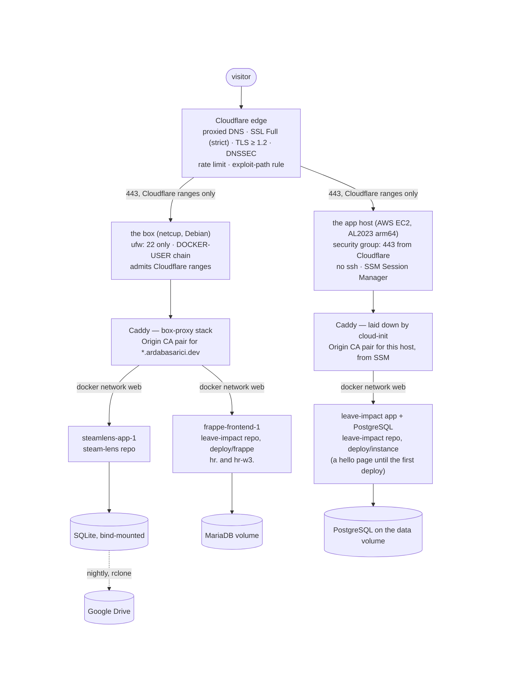
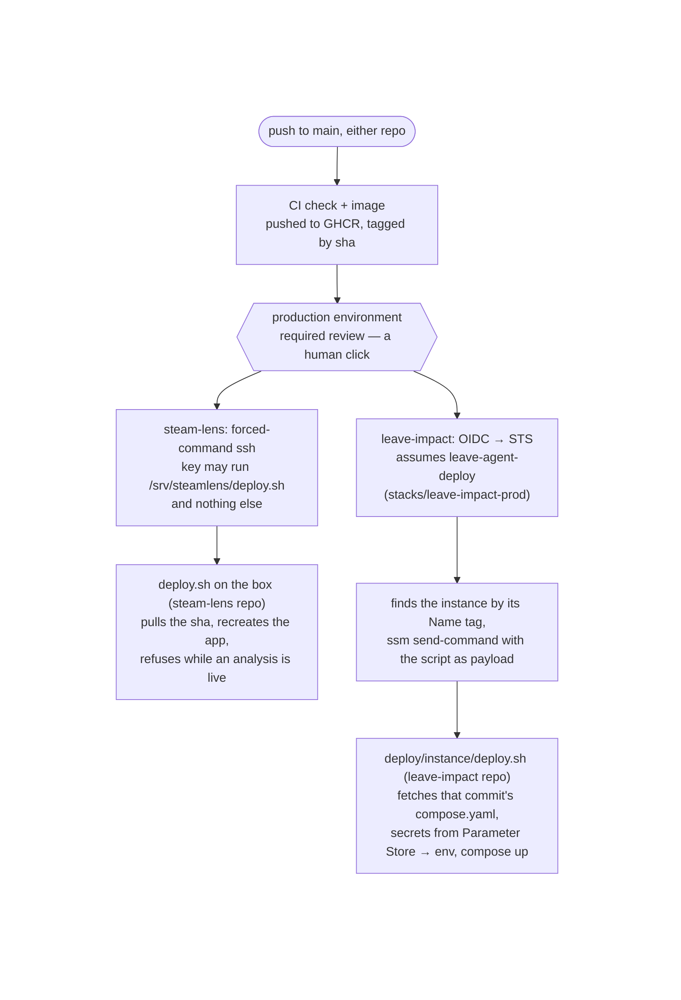
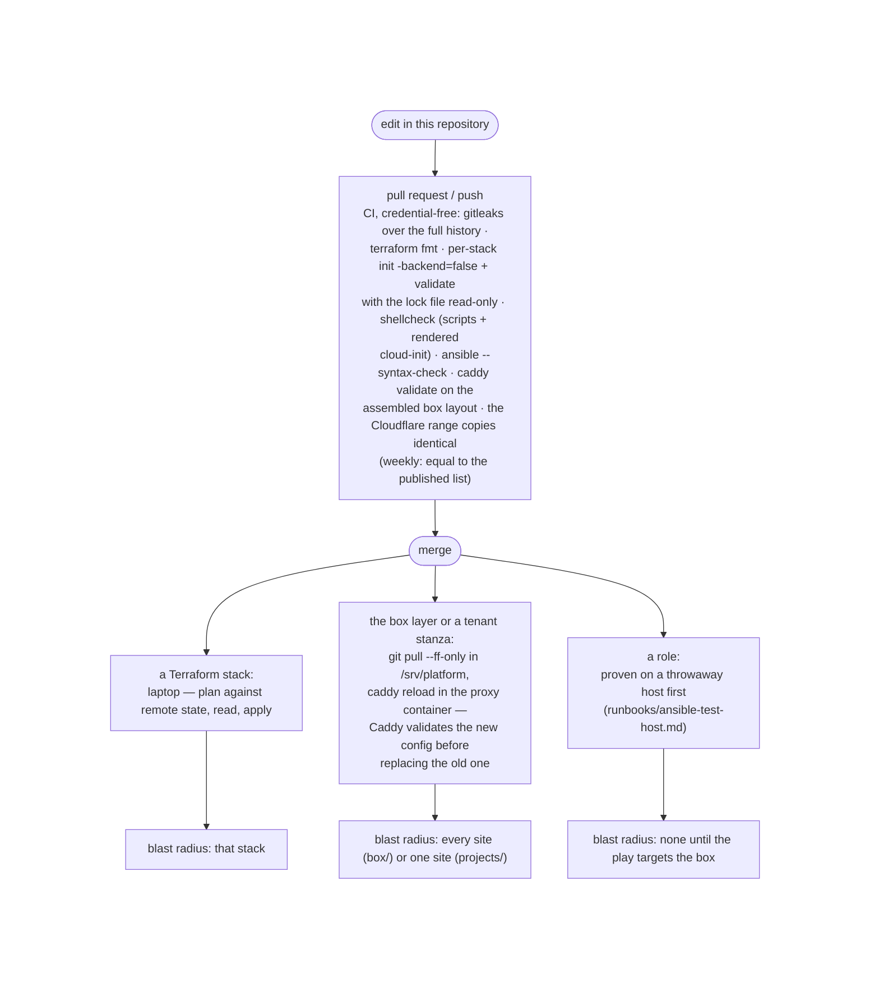

# ARCHITECTURE — platform

How the operational layer is built: the hosts, the paths a request / a deploy / a
backup / an infrastructure change take through it, the edge as it stands, the box
from a blank host, the repository and state maps, and the seam between platform and
application. The *why* behind each shape is [DESIGN.md](DESIGN.md)'s (cited by name);
the pitch is [README.md](README.md)'s. This document describes the system as it runs.

*Snapshot of the running system · last updated 2026-09-02 · the extraction from
steam-lens complete (the box has served from this checkout since 2026-08-27), both
Terraform stacks adopted zero-diff (2026-08-27 and 2026-08-28), the box playbook
proven on a blank host (2026-08-28), compared against the live box in check mode
(2026-08-30, ten differences, all classified) and drilled end to end the same day
(blank host and control node to SteamLens serving restored data,
`runbooks/box-rebuild.md`); the SteamLens backup restore-checked monthly by a timer.
The live box has not yet been replayed by the playbook; the restraint list at the
end carries what is deliberately not done.*

---

## The physical picture

Two hosts sharing one origin-security and proxy contract, each implemented in its
provider's idiom, each serving its own tenants behind its own proxy, both behind one
Cloudflare zone. Nothing runs on both.

The rules that make them the same machine twice:

| Rule | On the box | On the app host |
|---|---|---|
| The origin answers only Cloudflare, only on 443 | DOCKER-USER chain from `firewall.sh`, applied each boot by a systemd unit ordered before Docker | security group ingress from Cloudflare's IPv4 ranges, nothing else inbound |
| TLS at the origin is a Cloudflare Origin CA pair, never ACME | one pair for `*.ardabasarici.dev`, copied from the workstation | one pair issued for this host alone, read from SSM at first boot |
| Caddy trusts `CF-Connecting-IP` only from a Cloudflare peer | global `trusted_proxies` block | same block, rendered by cloud-init |
| Applications join `web` as an external network and publish no port | created by the `docker` role | created by cloud-init |
| The proxy reaches an application by its Compose container name | `steamlens-app-1:8000`, `frappe-frontend-1:8080` | the app's service name (`hello:80` until the first deploy) |
| Administrative access | key-only ssh, root login off | no ssh at all; SSM Session Manager |

What differs is how each host came to exist. The box was provisioned by hand from
the runbook in `box/README.md`, and that runbook is now transcribed into the Ansible
play under `ansible/` (the section "The box from a blank host", below). The app host is
`terraform apply` plus a first-boot script (`user_data.sh.tftpl`) that installs
Docker and a checksum-pinned Compose plugin, formats and mounts the data volume on
first boot only, waits for the origin pair to appear in Parameter Store, writes the
proxy's Caddyfile and starts it. A replaced instance serves a hello page until the
next approved deploy lands the application.

## The four paths

**A request.** Visitor → Cloudflare edge (HTTP redirected to HTTPS there, the
rulesets and bot detection applied, caching where eligible) → origin over 443 with the edge as the
TCP peer → the host firewall admits it because the source is a Cloudflare range →
Caddy terminates TLS with the origin pair, matches the `Host` to a site stanza, sets
the security headers and the request-body cap the stanza declares, rewrites
`X-Forwarded-For` to the single verified visitor IP → `reverse_proxy` to the
container name over `web` → the application. A tenant's stanza is the only
per-tenant part of that path; everything before it is shared.

*Response headers, and which layer's value is live.* Three layers can set them:
the edge (the zone's HSTS setting with `nosniff`), a tenant's stanza (`header`
block), and the application itself (Frappe's nginx sends its own HSTS, 2 years with
preload). Cloudflare's setting replaces the header on every proxied response, so
the edge's value wins: every proxied hostname served `max-age=86400` on 2026-08-29
and `max-age=15552000` on 2026-09-15 (the raise, after the canary), while the
steamlens stanza declares 180 days and Frappe's nginx two years. Both origin
copies are therefore dead in effect and kept as marked fallbacks (comments in the
stanzas say so), live only if the edge setting were ever removed. Headers the edge
does not set (`Referrer-Policy`, `Permissions-Policy`, `X-Frame-Options`) pass
through from whichever origin layer set them.

**An application deploy.** Two shapes, both gated by a GitHub `production`
environment with a required reviewer, both shipping an image tagged by the exact
commit CI tested. The gate lives in GitHub's settings, not in this tree, so it is
read back on a date rather than assumed: on 2026-08-30 (`gh api …/environments/production`)
the leave-impact environment had the required reviewer and a deployment-branch policy
naming `main` only — the two facts the deploy role's trust (`deploy.tf`) relies on;
the SteamLens environment had the reviewer and no branch policy (a gap in that
project's own settings, not this repository's). Frappe's own login brake (consecutive-failure lockout) was read the same day
on both sites and is on; its values are the application's, not recorded here:

In both, the platform's part ends at the door: the ssh forced command on the box;
on AWS the OIDC provider, the deploy role whose trust policy names one repository's
`production` environment by numeric id, and an `ssm:SendCommand` permission scoped
to instances tagged `leave-agent-app`. What runs behind the door is the
application's.

*The benchmark's door, beside the deploy path.* The same OIDC provider trusts the
repository's `benchmark` environment (its own required reviewer and `main`-only
rule, read back 2026-09-12) for two more roles: the world generator and the
validator, whose reach is the two benchmark buckets and, for the generator, its
pair of Bedrock models. Nothing on either host is in their path; the buckets are.
The instance role reads the world bucket's `worlds/` prefix and holds no
assume-role grant, so the answer key in the truth bucket is out of the
application's reach by construction. The application's own deploy step asserts
that negative live, under the real instance profile (DESIGN, the ownership line).

**A backup.** A systemd timer on the host runs a per-tenant script from
`projects/<name>/`. steam-lens's takes a WAL-safe `sqlite3 .backup`, integrity-checks
it before shipping (an unverified upload of a corrupt file preserves the corruption),
gzips, uploads to Drive with the host's rclone, prunes to 7 daily + 4 weekly, and
pings a healthchecks.io dead-man's switch, so the alert channel is silence. On the
first of each month a second timer restores the newest object on the same host,
integrity-checks it and compares four table counts with the live store
(`restore-check.sh`), pinging its own dead-man only on a pass. Backups
exclude deployment secret material by construction (`.env`, certificates, Caddy
state: each regenerable from the repositories or the dashboard); the database
backups themselves are sensitive data and are treated as such. This is the only
backup that exists: Frappe's MariaDB and the app host's PostgreSQL have none (the
restraint list, below, carries the trigger).

**An alert.** Three channels, each for what it can actually see. From outside: the
four UptimeRobot monitors (below, "Set by hand") say whether each hostname's
upstream answers. From the box: the backup's dead-man's switch on healthchecks.io
says whether last night's run happened (and, monthly, whether the backup still
restores). From AWS: one SNS topic (`leave-impact-alerts`, one confirmed e-mail
subscriber) receives the alarms and the anomaly findings — two CloudWatch alarms on the app host's status checks (a *system*
check failure recovers the instance onto healthy hardware, same id, EIP and volumes,
and notifies; an *instance* check failure, the OS itself, only notifies, since an
automatic reboot would erase the evidence) and Cost Anomaly Detection's default
per-service monitor at a $2 absolute threshold, delivered when found rather than in
a daily digest. The budget's four thresholds mail the same address directly, not
through the topic: a deliberate exception (routing them would need a budgets
service principal in the topic policy and its own delivery test, for no second
subscriber). Delivery through the topic was proven on
2026-08-30 by forcing the instance-check alarm into ALARM by hand: the first try
was refused at the topic (a policy that named the account where CloudWatch
publishes as a service principal), visible only in the alarm's action history —
the silent failure an unproven alarm hides — and the second try, after the fix,
delivered the ALARM and the OK mails. Nothing watches the box's host itself beyond the monitors,
and nothing watches disk on either host (the restraint list).

**An infrastructure change.**

CI can reach no backend, provider, or host by design (DESIGN, "Terraform: plan and
apply stay on the laptop"). The read-only lock file makes a provider bump a
deliberate commit: a lock that no longer matches its constraints fails the init.
The Terraform line is `~1.15`; the providers are pinned by the lock files, with
hashes for both the Windows laptop and the Linux runner.

## The edge, as it stands

Everything Cloudflare does for the zone, by who owns it. Read by API on 2026-08-28
with a read-only inventory token and kept current by the `edge` stack's plan.

**In code (`terraform/stacks/edge`).** Every record of the zone (eleven: eight
adopted and three created from code on 2026-08-28, and since then the world sites' records added and removed with their sites: the second on 2026-09-15, the third added 2026-09-16, the first removed the same day): the four proxied A records (`steamlens.`, `hr.`, `hr-w3.` to the box; `leave-agent.` to the
app host's elastic IP), the portfolio site's apex and `www` CNAMEs (DNS-only; GitHub
Pages terminates their TLS) and its two verification TXTs, and the three no-mail
records (a null MX, SPF `-all`, DMARC reject). Settings: `ssl = strict`,
`always_use_https`, `ipv6`, `min_tls_version = 1.2`, HSTS (six months since
2026-09-15, after a canary at one day from 2026-08-28; no subdomains, no preload;
it binds the proxied hostnames only, so a hostname that has served it stays
proxied) with `nosniff`. One custom rule, `exploit-path noise` (blocks `.php`,
`/wp-`, `/.env`, `/.git` paths; 1 of the free plan's 5 slots). The one free
rate-limiting rule, `client flood shed`: 300 requests / 10 s per source IP per colo
on every proxied host, verified bots exempt, block for 10 s; a coarse ceiling on one
client, tuned only from evidence. Endpoint-aware limits stay with the applications
(steam-lens's `/search` relies on its own limiter). Bot Fight Mode off since
2026-09-14 (on from the zone's creation until then; the paragraph below says why),
the AI-crawler controls at their defaults. DNSSEC complete: the zone is signed at
Cloudflare, the DS record is the stack's `dnssec_ds` output, and a live read on
2026-09-15 found that record at the `.dev` parent (a DS query against the registry,
its RDAP `delegationSigned true`) with answers validating (`AD` set at Google's and
Cloudflare's public resolvers). The chain closed by 2026-09-14, seventeen days after
the zone was signed (2026-08-28): absent on a 2026-09-13 read, present the next
evening. The registrar's DS submission is automatic and offers no manual step, and
the state is read from the parent, never inferred from the plan. The zone
itself is a data lookup by name, never a managed resource.

**Cloudflare-managed, on by default, unmanaged on purpose.** The DDoS L7 ruleset (no
override created; one would be a `ddos_l7` ruleset in code) and the network-layer
and TLS DDoS protections beneath it, the Managed Free WAF ruleset, URL
normalization, TLS 1.3, post-quantum key exchange, Encrypted Client Hello, HTTP/2
and HTTP/3, Brotli, Universal SSL (Google CA, apex + wildcard), `security_level =
medium`, the browser integrity check. A plan default is not a decision; none of
these appear in code until one is changed from code.

**Set by hand and recorded here, because no token or provider surface covers them.**
Two account-level notifications, both e-mail: Certificate Transparency Monitoring (a
certificate for the domain issued by any CA other than Cloudflare's own) and the
Universal SSL alert (issuance, renewal, validation failures); account scope sits
outside both zone tokens, and two alert toggles do not justify a wider one. Four
UptimeRobot monitors (free tier, one account, e-mail alerts): `steamlens` as an HTTP
check on `/healthz` since 2026-08-10, and since 2026-08-30 keyword checks that must
find the upstream's own body — `pong` from Frappe's `/api/method/ping` on `hr`
and `hr-w3`, the hello page's name on `leave-agent` —
every 5 minutes; a keyword distinguishes "the upstream answered" from "Cloudflare
answered something". A build site (a world site raised to be read and dropped, as
`hr-w2` was on 2026-09-15) has no monitor by ruling: short-lived, and a down served
world site already signals the bench. A served world site (`hr-w3`, the golden
world's home) gets one with the site and loses it with the site, as the first
world's went on 2026-09-16, the day the golden world was approved and `hr-w1` was
torn down. Until
2026-09-13 they were also read as the standing Bot Fight Mode observation, a
machine client passing every check; they were not one. UptimeRobot is on
Cloudflare's verified-bots list, which the mode exempts by design, so twenty green
days said nothing about an unverified client. The
zone's `security.txt` (RFC 9116: the contact mailbox, languages en/tr, expires
2027-08-29 and must be renewed before then; served by Cloudflare at
`/.well-known/security.txt` on the proxied hosts only; the provider has no resource
for it). Two Security-page insights archived as accepted risk: the unproxied CNAMEs
(GitHub Pages terminates its own TLS) and AI Labyrinth (nothing to protect from AI
crawlers, and blocking them hides the portfolio from AI search).

**Bot Fight Mode, off since 2026-09-14.** On the free plan it runs across the whole
zone, challenges on network reputation alone, and has no exception mechanism: no
WAF skip, no IP allowance. On 2026-09-13 the world site's first cloud-network
machine clients, the app instance and a GitHub-hosted runner, were answered with a
managed challenge on their first request (Security Events: service Bot Fight Mode,
action Managed Challenge, seven events), while the workstation passed on the same
user agents; every earlier "machine client passed" reading had been a verified bot
or a workstation run. A world site exists to be driven by machine clients, so a
control that cannot tell them from scrapers is the wrong control for this zone, and
it was turned off from code (`stacks/edge/bot_management.tf`, the resource kept so
the state stays readable and reversible; the JS detection beacon off with it). What
stands: the DDoS and managed WAF rulesets, the exploit-path rule, the rate limit,
the ranges-only origins. Super Bot Fight Mode (Pro) is the first plan tier with
exceptions; paying for it needs observed automated abuse on the zone, not a feature
count, and the mode comes back on for the browser hostnames only if the machine
clients leave the public edge (the private-connectivity design step).

**Two tokens, by job.** A write token scoped to exactly what the stack manages (DNS,
zone settings, zone WAF, bot management; grown one scope at a time as each resource
was adopted) and a read-only inventory token that answers "what is set?" so audits
never widen the write token. Both are workstation user environment variables per
`SECRETS.md`.

## The box from a blank host

`ansible/site.yml` is `box/README.md` transcribed: one play, five roles in a fixed
order because each depends on the one before, so a failure names its section.

| Role | Does | Why this position |
|---|---|---|
| `hardening` | installs the sshd drop-in (key-only, no root, no keyboard-interactive) and reloads sshd while the current session can still catch a lockout; installs ufw and unattended-upgrades; allows 22 *before* enabling ufw default-deny; arms the security-update timers | first: everything after it rides the hardened ssh |
| `docker` | Docker's own apt repository (the distro package lags majors), Engine + the Compose plugin, the login user in group `docker` with a forced re-login so the group takes effect mid-play, the shared `web` network | before the firewall: the DOCKER-USER chain does not exist until Docker does |
| `firewall` | the `/srv/platform` checkout (its first consumer; the deploy owns the revision afterwards), `firewall.sh` + `box-firewall.service` enabled and applied, an uplink drop-in where the interface is not `eth0`, then an assertion that the chain carries the origin rules (a 443 match and a DROP) | needs Docker's chains; must precede the proxy so no port is ever published unguarded |
| `proxy` | the runtime root `/etc/platform`, the origin pair installed from a workstation path outside the repository (key 0600), the proxy stack up | needs the checkout and the firewall |
| `backups` | sqlite3 + rclone, the tenant's runtime directory, the backup and restore-check units installed from the checkout, each with a drop-in setting `User=` to the inventory's login user, the nightly backup and monthly restore-check timers enabled; verifies the rclone remote exists as the login user | last: needs the proxy's directories; the Drive OAuth itself stays a manual step (headless token exchange; the procedure is `projects/steamlens/README.md`, "One-time setup"), so the role fails on the box and only warns on a test host (`backups_require_remote: false`) |

`ansible/verify.sh` is the acceptance checklist, run on the host as root: every
runbook section read back from the running system (sshd's *effective* config via
`sshd -T`, ufw active with 22 the only allow, the apt timers armed, Docker and `web`,
the DOCKER-USER chain admitting 443 from each pinned Cloudflare IPv4 range and dropping
the rest on the uplink, the key 0600, Caddy the only container publishing a port).
On a host that has no application, Caddy answering every hostname over the installed
pair with a 502 is the pass: the upstream is absent by design. The one check that
cannot prove itself from inside, the bare IP timing out on 443 from the internet,
is run by hand from the workstation.

The blank host is a hand-launched throwaway EC2 instance (`runbooks/ansible-test-host.md`:
a Debian image of the box's own major in the leave-impact region, its own security
group and key pair, never in a stack's state, terminated after the run). The control node is WSL with a
dedicated key; the committed inventory is an example, the real one is gitignored,
and the live box is addressed by its ssh alias so the origin address never enters
this public repository. The play reached a passing `verify.sh` on a blank host on
2026-08-28. Against the live box it has run in check mode only (2026-08-30: ten
differences, every one a transcription difference — file modes, the spelling of the
same sshd and ufw state, the play's own backup-user drop-in); that box was built by
the runbook the play transcribes, and the replay itself is pending (the restraint
list, below). The
control node (WSL) holds three things for that: the box key (`~/.ssh/platform-box`),
the `box` alias in its ssh config, and the Origin CA pair at `~/.platform/certs`,
which is copied in for a run and removed after — the control node is not a store
for it. The proof host has shared the box's major, Debian 13 (trixie), since that
comparison: the 2026-08-28 runs used Debian 12, whose image shipped the `gnupg` the
box's lacks.

## The box, on disk

This repository is checked out on the box at `/srv/platform` and is deployment
material only: no edits there, and a deploy is `git pull --ff-only` followed by
`caddy reload` in the proxy container (`compose up -d` only when the proxy's own
Compose file changed), so a checkout that diverged fails the deploy instead of
merging box-local state. The proxy mounts the `box/` directory, not the Caddyfile
alone: a single-file bind mount pins the inode and git replaces files by rename, so
the container would keep the pre-pull config (observed 2026-08-27, three 200s on
the old config). `git rev-parse HEAD` in the checkout answers which platform
configuration is deployed (not which application images run; those are the
applications' deploys). Machine-local material lives outside the checkout under
`/etc/platform/`: `box/certs/` (the Origin CA pair), `<tenant>/` (files decrypted
from that tenant's `*.enc.env`, pushed from the workstation). Cloning creates none
of it; the runbook and the `proxy` role provision it. Applications keep their own
`/srv/<name>/` directories.

## The tenant seam, mechanically

A tenant is one directory under `projects/` and one line in the application's
Compose file (`networks: web: external: true`). The proxy mounts the checkout's
`projects/` read-only at `/etc/caddy/projects/` and the global Caddyfile imports
`*/sites.caddy`: one file per tenant holding all of its sites, because Caddy's
`import` accepts a single wildcard in its pattern (`*/*.caddy` is rejected at adapt
time; observed with `caddy validate` on 2.11.4 before the cutover, which is what
turned the first draft's per-hostname files into one file per tenant). A new
tenant's stanzas are live on the next `caddy reload` of the proxy without touching
`box/` or the proxy's Compose file; `runbooks/add-a-tenant.md` is the platform half
of onboarding. The values crossing the seam, and who produces each, are DESIGN's
contract table, instantiated in each `projects/<name>/README.md`. The backup units
follow the same pattern: the timer and service under `projects/<name>/` are
installed into `/etc/systemd/system/` by the `backups` role, and the script they
run, from the checkout, knows that tenant's data.

## Repository map

| Path | Holds | Changes |
|---|---|---|
| `box/compose.yaml` | the proxy stack: Caddy 2, 443 only, the `box/` and `projects/` directory mounts, the cert mount from `/etc/platform`, the `web` network as external | slow |
| `box/Caddyfile` | the global block (Cloudflare `trusted_proxies`, the client-IP header), the shared `origin_tls` snippet, `import /etc/caddy/projects/*/sites.caddy` | slow |
| `box/firewall.sh`, `box/box-firewall.service` | the DOCKER-USER origin-only chain, applied each boot before Docker; the uplink from `IFACE` (default `eth0`) | slow |
| `box/README.md` | the provisioning + hardening runbook the play transcribes; still the reference for the manual origin-pair step (the Drive OAuth is the steamlens adapter README's) | slow |
| `ansible/` | `site.yml`, the five roles, `verify.sh`, `ansible.cfg`, the example inventory | slow |
| `projects/steamlens/` | `sites.caddy` · `backup.sh` · `steamlens-backup.service` · `steamlens-backup.timer` (unit names are host-global, so they carry the tenant) · `restore-check.sh` · `steamlens-restore-check.service` · `steamlens-restore-check.timer` (monthly, read-only) · `backup.enc.env` (`BACKUP_PING_URL`, `RESTORE_PING_URL`) · README (the contract values, the backup setup, the restore check and the restore procedure) | fast |
| `projects/leave-impact/` | `sites.caddy` (the `hr` and `hr-w3` stanzas) · README (the contract values, including the deploy role ARN, the instance tag, and the SSM prefix) | fast |
| `terraform/stacks/leave-impact-prod/` | VPC, subnet, IGW, route table · security group · instance role + profile (SSM core, parameter reads under `/leave-agent/`, Bedrock invoke on a shortlist) · the instance (AL2023 arm64 via the SSM public AMI parameter), its EIP, the data volume · the GitHub OIDC provider + deploy role · the three SSM parameter *names* · the monthly budget · the alerts topic, its e-mail subscription and policy, the two status-check alarms, the adopted cost-anomaly monitor and subscription · the benchmark's world and truth buckets (versioned, TLS-only, create-only on their final prefixes) with the generator and validator OIDC roles and the instance role's world read · the state bucket itself · `user_data.sh.tftpl` | per stack |
| `terraform/stacks/edge/` | the zone's eleven records (seven of the eight adopted, the first world site's gone with its site; the three no-mail ones created from code; the current world site's) · five settings (three adopted, the TLS floor and HSTS created from code) · the two security rulesets · the bot control (Bot Fight Mode, off since 2026-09-14) · DNSSEC; the zone is a data lookup | per stack |
| `runbooks/` | `add-a-tenant.md` · `ansible-test-host.md` · `replace-the-app-host.md` · `box-rebuild.md` (written during the 2026-08-30 drill); each written when first exercised | — |
| `SECRETS.md`, `.sops.yaml` | the secrets policy; the SOPS creation rule (two public age recipients: workstation, recovery) | slow |
| `scripts/check-cf-ranges.sh` | the check CI and the laptop share: the three pinned copies of Cloudflare's IPv4 ranges (the box Caddyfile, `firewall.sh`, the security group's variable) against each other and, given the published list, against it | on a range change |
| `.github/workflows/ci.yml`, `.github/workflows/cf-ranges.yml`, `.githooks/pre-commit` | the credential-free CI; the weekly run of the range check against Cloudflare's published list; the fail-closed gitleaks hook | slow |

Everything on the application side of DESIGN's ownership table stays in its
application repository; the map above is the whole of what this one holds.

## State map

One remote state per stack, both in one S3 bucket, locked with S3 conditional
writes (`use_lockfile`), no DynamoDB. The bucket lives in the leave-impact AWS
account, so a plan of the `edge` stack needs that account's identity (the
Identity Center profile) for its state as well as the Cloudflare token for its
resources: the two stacks share a backend identity and nothing else.

| Stack | Backend key | A bad apply breaks |
|---|---|---|
| `leave-impact-prod` | `leave-impact-agent/terraform.tfstate` (unchanged by the move from the agent's repository) | the app host and its deploy path |
| `edge` | `edge/terraform.tfstate` | every hostname |

**The bucket that holds its own state.** The bucket was made by hand on 2026-08-22,
because a stack cannot store state in a bucket it has not created yet, and adopted
by import into `leave-impact-prod` on 2026-08-28 rather than given a second stack:
versioning, encryption, the public-access block, owner-enforced ACLs, and a
lifecycle rule are code now, with `prevent_destroy` on the bucket, since destroying
it would destroy the stack's own state. The lifecycle rule expires noncurrent
versions after 30 days (the rollback horizon for a corrupted write) and clears the
delete markers the lock file leaves behind on every plan.

**Secret values and state.** The `aws_ssm_parameter` resources carry a placeholder
through the provider's write-only argument (`value_wo` + `value_wo_version`); the
provider sends it once and never reads the value back, so the real content, put
out-of-band from a terminal, never enters state. Proven 2026-08-27 on a disposable
parameter (create → apply → overwrite via the CLI → `apply -refresh-only` → `state
pull`: the marker string absent, `value` empty, only the version counter moved),
then applied to the three production parameters. Until that day the resources used
`value` + `ignore_changes = [value]`, which kept the value out of plans but not out
of state: refresh read the parameter decrypted and stored it marked sensitive, and
the state file did hold the certificate and the private key (verified by length
before the migration). The migration cleared them from the current state, and the
seven noncurrent versions that still held the key material were purged by hand the
day the lifecycle rule landed. Two facts govern any future change here: the switch
was an in-place update, not a replacement; and a change to `value_wo_version` makes
the next apply write the placeholder over the real value, so the values are saved
first and re-put right after, then read back.

## Deliberately not done, and what would bring each in

- **The app host is single-tenant.** Its proxy configuration is laid down by
  `user_data.sh.tftpl` inside `stacks/leave-impact-prod`, and the `projects/`-style
  adapter is extracted there only if a second tenant arrives (DESIGN, the ownership
  table). The Caddyfile flip from the hello page to the app, when its first HTTP
  surface lands, happens in that stack.
- **No backup for Frappe's MariaDB or the app host's PostgreSQL.** The trigger is
  data worth keeping: the leave-impact agent's first generated world (the
  simulated organization it plans over). Until then a
  dump unit protects placeholder data, and its restore drill would drill nothing.
- **The live box has not been replayed by the playbook.** It was built by the
  runbook the play transcribes and verified by the same checks. The check-mode
  comparison ran on 2026-08-30 (ten differences, all explained; `verify.sh` 23/23)
  and the control node's key is in the box's `authorized_keys` since. The replay
  itself is the one open host step, run pure: no play change rides it, check mode
  is repeated immediately before, and a difference that needs a play fix aborts it
  (fix, CI, blank host, restart). Done when a second run reports `changed=0`.
- **Traffic evidence is a 24-hour window.** Security analytics on the free plan keep
  a day; a decision that needs traffic evidence (widening the exploit-path rule,
  moving the rate-limit threshold) reads that window on the day, not a history.
- **No key on either host for SOPS.** Values are decrypted on the workstation and
  pushed over ssh; a platform-box recipient that lets the box decrypt its own files
  moves the host-compromise boundary and is an explicit later change.
- **No disk signal on either host, and Docker's logs are unbounded.** Neither
  host has a `daemon.json`, so container logs grow without rotation (read
  2026-08-30: 70 MB on the box at 16 % of a 78 GB disk, 92 KB on the app host at
  20 % of 12 GB). Rotation is a Docker restart on the box (every site blinks) and
  an instance replacement on AWS (it lives in cloud-init), so both wait for the
  next controlled recreate or patch day; a free-space signal comes with them,
  shaped like the backup's dead-man (ping only while space is above a threshold),
  and it watches the data volume too. What the absence costs was read on
  2026-09-15: the app host's root at 99 %, 134 images holding 8.95 GB, one per
  deploy since the instance's last replacement because the deploy script never
  pruned, and the signal was two red deploys. A one-off `docker image prune` over
  SSM reclaimed 8.59 GB (23 % used after, the OS being 2.8 GB of it), the script
  prunes from then on, and the 12 GB root stays: it holds no data (`/srv`, the
  20 GB data volume, was at 1 %), and the steady state is four images.
  The box's host itself has no alarm beyond the external monitors; netcup offers
  no status-check equivalent.
- **Replacing the app host's instance costs minutes of downtime, accepted.** A
  change to `user_data.sh.tftpl` replaces the instance (the data volume is
  re-attached, the Elastic IP moves with it); there is no blue-green or second
  instance, and none is planned while one hello page or one application is what
  goes dark. Exercised 2026-08-29 (about three minutes end to end);
  `runbooks/replace-the-app-host.md` is the procedure and its seven checks,
  including the one that tells a re-attached data volume from a freshly
  formatted one.
