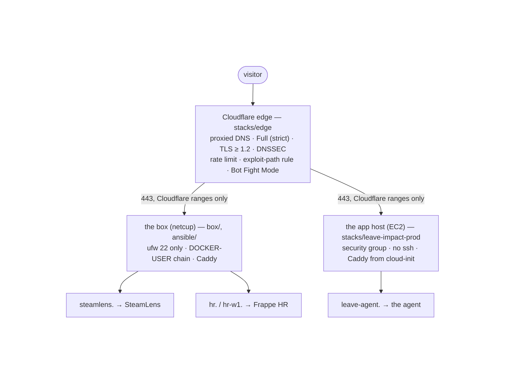

<div align="center">

# platform

**How are two independent projects operated on two hosts behind one edge, from one
repository, with nothing done by hand twice?**

[](https://github.com/arda-basarici/platform/actions/workflows/ci.yml)


[](LICENSE)

</div>

The operational layer under the portfolio's deployed projects: the shared Cloudflare
edge, the two hosts (a netcup VPS and an AWS EC2 instance), the cloud resources, and
the per-project wiring that joins an application to them. One repository, owned by
no application. Two tenants ([SteamLens](https://github.com/arda-basarici/steam-lens)
and the [leave-impact agent](https://github.com/arda-basarici/leave-impact-agent)'s
HR system and app host) serve on four proxied hostnames; every DNS record of the
zone, every deliberately set edge setting and security rule, and every AWS resource
supporting the agent is Terraform: what existed was adopted or moved on zero-diff
plans, and the edge hardening that followed was applied from code; the VPS is
rebuildable from a blank host by a five-role Ansible play, proven on a fresh one. The
honest caveats: a single operator applies from a laptop, the live VPS was built by
the runbook the play transcribes and has not yet been replayed by it (compared in
check mode on 2026-08-30: ten differences, each explained), and only one of three
databases has a backup.

*Solo: the design, the extraction under production traffic, the imports, the
playbook, the secrets policy. Extracted 2026-08-26 to 2026-08-28 from a running
system, each step accepted before the next; the cutover cost one container
recreate.*

> [!NOTE]
> Scope, stated plainly. This repository is evidence of how the projects are
> operated, not a third project beside them. It owns infrastructure whose lifecycle
> crosses application boundaries or is managed through a provider API: hosts, proxy,
> edge, cloud resources, backup units. It never reaches into an application's image,
> Compose file, migrations, or code; those repositories ship themselves, and this one
> wires them.

## Why it exists

SteamLens was the first service on the VPS, so its repository carried the host:
proxy, firewall, provisioning runbook. Reasonable with one tenant. When the second
project's HR system landed on the same box, a leave-impact ingress change became a
commit in the SteamLens repository, and the box's Caddyfile carried three stanzas
from two projects. The shared layer was already there; the second application made
it visible. This repository is that layer, extracted with an explicit
platform/application boundary, and then extended to the two places that were still
hand-made: the Cloudflare zone and the host's own construction.



## What it holds

| Layer | Where | State |
|---|---|---|
| The edge: every record of the zone, the deliberately set settings, the two security rulesets, bot control, DNSSEC | `terraform/stacks/edge` | in code since 2026-08-28; the zone itself is a lookup, never managed |
| The AWS host the agent runs on: network, security group, instance role, instance + data volume, the GitHub OIDC deploy role, the parameter *names*, the budget, the host alarms and their topic, the state bucket | `terraform/stacks/leave-impact-prod` | moved from the agent's repository 2026-08-27, zero-diff |
| The box's shared layer: the proxy stack, the global Caddyfile, the origin-only firewall, the runbook | `box/` | serving from this checkout since 2026-08-27 |
| The box from a blank host: five roles in dependency order + the acceptance script | `ansible/` | passes on a blank host (2026-08-28); compared against the live box in check mode (2026-08-30, ten differences, all classified), not yet replayed |
| Per-tenant adapters: site stanzas, backup units, the contract each tenant and the platform agree on | `projects/<name>/` | two tenants |
| The secrets policy: ownership, classes, stores by workload identity, recovery | `SECRETS.md`, `.sops.yaml` | the exact inventory stays private |
| Runbooks, written when first exercised | `runbooks/` | add-a-tenant · the Ansible test host · replace the app host |

## Proven, not asserted

| Claim | How it was tested | The honest caveat |
|---|---|---|
| The AWS stack moved repositories without touching production | `terraform plan` on the same remote state after the move: **0 to add, 0 to change, 0 to destroy** | the same state key; a move, not a rebuild |
| The hand-made edge is fully described by code | every import (8 records, 3 settings, 2 rulesets, bot control) landed as `N to import, 0/0/0`, then `No changes`; what followed was created from code (the three no-mail records, the TLS 1.2 floor, HSTS, DNSSEC) and verified live (a TLS 1.0 handshake refused; the zone signed at Cloudflare, its DS record not yet at the `.dev` registry when last read, 2026-08-29) | only settings that were set on purpose entered code; Cloudflare's defaults stay unmanaged by design |
| The production secret values in Parameter Store never enter Terraform state | proven on a disposable SSM parameter (`state pull` after an out-of-band overwrite: the marker absent, `value` empty), then applied to the three production parameters | before the migration the state *did* hold the origin key; the old versions were purged and a lifecycle rule now expires them |
| The box is rebuildable from the repository | a blank Debian 12 cloud host reached a passing `verify.sh` (sshd key-only, ufw 22 only, the Cloudflare-only chain, the proxy answering every hostname) from the play alone | the live box has not been replayed; a 502 is the pass on a host with no application |
| The live box is what the play describes | `--check --diff` against the live host (2026-08-30, at `379cb50`): ten differences, all classified as transcription — the hand build's looser file modes (`0775` scripts, `0664` unit files owned by the login user; the play sets `0755` / root-owned `0644`), the sshd drop-in and the ufw allowance spelled differently for the same effective state, the backup-user drop-in the play had introduced two days earlier, one unit comment newer in the checkout. Then `verify.sh` on the live box: 23/23 PASS | check mode cannot compare `command` tasks (compose up, ufw enable), so "matches the play" waits for the replay and a second `changed=0` run. The comparison itself fixed three role gaps: `gnupg` missing from the prerequisites (the box's Debian 13 image ships none, the Debian 12 test image did), and two read-only `command` tasks skipped in check mode whose guards then failed |
| The app host's failure reaches a person | two CloudWatch status-check alarms (system: recover + notify; instance: notify) on one SNS topic with a confirmed e-mail subscriber, applied 2026-08-30 as `2 imported, 5 added, 2 changed, 0 destroyed` (the account's default cost-anomaly monitor and subscription adopted in the same apply, its delivery moved from a daily digest to the topic); the path proven by forcing the instance alarm into ALARM — the first try found `CloudWatch Alarms is not authorized to perform: SNS:Publish` in the alarm history (the topic policy had named the account, not the CloudWatch service principal), one statement fixed it, and the second try delivered the ALARM and OK mails | the subscription's confirmation is a click in a mailbox Terraform cannot see; the box's host has no equivalent, only the external monitors |
| Both stacks stay zero-diff | dated plans 2026-08-30: leave-impact-prod `No changes` after the alarms apply; edge one in-place change, the DNSSEC `status pending → active` that waits on the registry's DS record | laptop-side, on demand |
| Adding a tenant changes no shared configuration | a tenant is one directory under `projects/` and one `caddy reload`; Caddy validates before swapping, so a broken stanza fails closed | Caddy's `import` takes one wildcard, which is why a tenant's sites live in one file |
| A deploy of the box layer is a commit hash | the box runs the proxy from a `git pull --ff-only` checkout; `git rev-parse HEAD` there is the deployed configuration | learned the hard way: a single-file bind mount pins the inode, and a pull replaced the file underneath it |
| The AWS deploy path holds no long-lived credential | GitHub OIDC → STS into a role whose trust names one repository's `production` environment, whose only *write* power is `ssm:SendCommand` on instances tagged for the app (the rest is finding the host and reading the command's outcome) | the SteamLens path still holds one secret: a forced-command ssh key that can run one script |

## Operate it

```
git config core.hooksPath .githooks                      # once per clone: the fail-closed secret scan
AWS_PROFILE=leave-impact terraform -chdir=terraform/stacks/edge plan   # the zone; its state rides the same S3 bucket, so the AWS identity too (laptop-side by design)
AWS_PROFILE=leave-impact terraform -chdir=terraform/stacks/leave-impact-prod plan
ansible-playbook -i ansible/inventory/local.yml ansible/site.yml   # a host from blank (WSL; runbooks/ansible-test-host.md)
ansible -i ansible/inventory/local.yml all -b -m script -a ansible/verify.sh   # the acceptance checklist, on the host
ssh box 'cd /srv/platform && git pull --ff-only && cd box && docker compose exec caddy caddy reload --config /etc/caddy/box/Caddyfile'   # a box-layer or stanza change
```

CI runs only what needs no credential, over every kind of configuration here:
gitleaks over the full history; `terraform fmt` and a per-stack `validate` with
the lock file read-only; ShellCheck on the three scripts a host runs and on the
cloud-init script rendered by the real `templatefile`; `ansible-playbook
--syntax-check` with the play's collections pinned; `caddy validate` on the box
layout with every tenant file imported and a throwaway pair where the Origin CA
pair sits (the pass is the adapted config naming every declared hostname, never
the word "valid" alone); the three pinned copies of Cloudflare's IPv4 ranges
diffed against each other, and weekly against the published list. Actions are
pinned by commit and moved by Dependabot pull requests, never by aging. `plan`
and `apply` never leave the laptop; a CI plan would need a read identity over
state and every provider, and its output does not belong in a public pull
request. The real inventory and the local `.tfvars` are gitignored; the
committed `.example` files show the shape.

## Layout

| Path | Responsibility |
|---|---|
| `box/` | the shared layer on the VPS: proxy stack, global Caddyfile, origin-only firewall, the provisioning runbook |
| `ansible/` | the same layer as five idempotent roles, `verify.sh` as the acceptance, the inventory example |
| `projects/<name>/` | one adapter per tenant: `sites.caddy`, backup units, the contract README |
| `terraform/stacks/edge/` | the Cloudflare zone's contents |
| `terraform/stacks/leave-impact-prod/` | the agent's AWS host and deploy path, plus the state bucket |
| `runbooks/` | procedures, each written the first time it ran |
| `scripts/` | checks CI and the laptop share: the Cloudflare range copies against each other and the published list |
| `SECRETS.md`, `.sops.yaml` | the secrets policy and the SOPS recipients |

## What it demonstrates

Infrastructure that appeared under real pressure rather than being designed in
advance, then brought under code with an acceptance test that leaves no room for
"probably fine": zero-diff plans for every adoption, a blank host for the playbook,
a state-pull proof for the secrets. The same operating discipline the applications
carry (approval-gated deploys, every trust boundary explicit, nothing hand-copied
twice) applied one layer down, at the layer the applications stand on.

## Development note

**AI-assisted development.** Claude Code was used extensively: the Terraform and
Ansible drafting, the imports, docs drafting, the inventory reads. The ownership
line, the secrets policy, the state boundaries, the acceptance criteria, and every
apply against production remained human-directed; the box itself is operated from
the author's own terminal.

## Deeper

[DESIGN](DESIGN.md) — the decisions and their reasons ·
[ARCHITECTURE](ARCHITECTURE.md) — the system as it runs: the hosts, the four paths,
the edge, the box from a blank host, the maps ·
[SECRETS](SECRETS.md) — the secrets policy ·
[runbooks](runbooks/) ·
[SteamLens](https://github.com/arda-basarici/steam-lens) and the
[leave-impact agent](https://github.com/arda-basarici/leave-impact-agent) — the
tenants

## License

MIT — see [LICENSE](LICENSE). Single-author portfolio infrastructure; the exact
secrets inventory and the hosts' addresses are deliberately not part of it.
